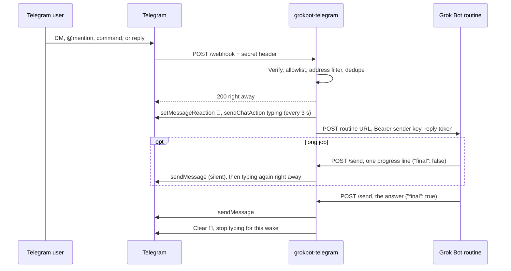

# grokbot-telegram

Connect a Grok Bot assistant to Telegram. People message the bot in a direct chat, or in a group by mentioning it, sending a command, or replying to it.

To install, tell your Grok Bot: "Read this repo and walk me through setting you up to connect with me on Telegram." The bot reads [`AGENTS.md`](AGENTS.md), goes through the requirements below with you, and then follows [Connect Grok Bot to Telegram](.grok/skills/telegram-connect/SKILL.md) one step at a time.

## Requirements

Enter each secret only in the host's secret settings or in your own terminal. When the bot asks, tell it that the name is saved.

- **Grok Bot.** This is the assistant that answers on Telegram. During setup it creates a routine with trigger `{ "type": "webhook" }`. You copy the routine URL to `GROK_WEBHOOK_URL` and the sender key to `GROK_WEBHOOK_SENDER_KEY`. The bridge sends that key as `Authorization: Bearer`.

- **Telegram.** You need an account and a bot from [@BotFather](https://t.me/BotFather) (`/newbot`). Store the token as `TELEGRAM_BOT_TOKEN`. Store the username, with the `@` removed, as `TELEGRAM_BOT_USERNAME`.

- **One host with a public `https` origin.** That origin is `PUBLIC_BASE_URL`. Telegram posts updates to `PUBLIC_BASE_URL` plus `/webhook`. Plain `http` works for localhost.
  - **Cloudflare Workers** (recommended). You need a Cloudflare account. Run `npx wrangler login`, then `npx wrangler secret put` for each secret, then `npx wrangler deploy`. The `CHAT_SESSION` Durable Object in `wrangler.toml` stores dedupe and typing state.
  - **Vercel.** You need a Vercel account. Import the repo in the project UI, or use the Vercel CLI, and set the variables in the project environment.
  - **Node** on Fly.io, Railway, Render, or a VPS. You need an account on that host. `npm start` listens on `PORT` (default `8080`). Put HTTPS in front and use that origin as `PUBLIC_BASE_URL`.

- **Node.js 22 or newer, npm, and a checkout of this repo.** Run `npm install`. After the deploy, run `npm run set-webhook` and `npm run set-commands` in that checkout, with the secrets in that shell.

- **Two secrets you generate.** Run `openssl rand -hex 32` twice. Use a new pair for every bridge.
  - `TELEGRAM_WEBHOOK_SECRET` is Telegram's `secret_token`. It needs 16 to 256 characters from `A-Z`, `a-z`, `0-9`, `_`, and `-`.
  - `REPLY_TOKEN_SECRET` signs reply tokens. It needs at least 32 characters.

- **An allowlist.** Set `ALLOWLIST_USER_IDS`, `ALLOWLIST_CHAT_IDS`, or both, as comma-separated decimal ids. With both empty, the bridge denies every sender. A user id admits that person in direct messages and in every chat they speak in. A chat id admits every sender inside that chat. Read `message.from.id` and `message.chat.id` from `getUpdates` before you run `npm run set-webhook`. After that, take the ids from a log line whose reason is `not_allowlisted`.

- **A group, if you want one.** Add the bot to the group. In Telegram's default privacy mode, the bot receives `/ask@YourBot`, replies to its own messages, and service messages. Test an `@mention` in the group. A bare `/ask` arrives only when this bot was the last bot to post, so ask people to send `/ask@YourBot`. To put ordinary chatter in the context buffer, turn privacy off with BotFather `/setprivacy`, or make the bot a group admin. After you change privacy mode, remove the bot from the group and add it again.

Other settings have defaults (see [Configuration](#configuration)). Setup is complete when `GET /healthz` returns `"ready": true` and an empty `problems` list.

### For agents

Follow [Connect Grok Bot to Telegram](.grok/skills/telegram-connect/SKILL.md) one step at a time, and finish each check before the next step. Create the webhook routine with your routine tool and the saved prompt in step 9 of that file, with `BRIDGE_ORIGIN` replaced by the `PUBLIC_BASE_URL` origin. The person copies the routine URL and sender key from the agent's info pane (the agent's name in the chat header, or Cmd+Shift+I), under Routines. Ask whether each secret name is saved. On each later wake, follow [Reply in Telegram](.grok/skills/telegram-reply/SKILL.md).

## How it works

1. Telegram delivers an update to the bridge.
2. The bridge checks the webhook secret, the allowlist, and, in groups, whether the message addressed the bot.
3. The bridge answers Telegram at once, then wakes the Grok Bot webhook routine with a short-lived reply token.
4. The assistant replies through the bridge's `/send` endpoint. The bridge holds the bot token and sends the Telegram message.



## Set up by hand

1. Gather the [Requirements](#requirements) and set each variable on the host.
2. Ask your Grok Bot to create a routine with trigger `{ "type": "webhook" }` and the saved prompt from step 9 of the [connect skill](.grok/skills/telegram-connect/SKILL.md). Open the agent's info pane, find the routine under Routines, and copy its URL and sender key into the host secrets.
3. Deploy.
4. Point Telegram at the deployment:

   ```bash
   npm run set-webhook
   npm run set-commands
   ```

5. Message the bot in a direct chat, then try a group.

## How the assistant replies

Each accepted update reaches the routine as JSON with `schema_version: 2` ([`schema/wake-event.v2.json`](schema/wake-event.v2.json)). The `reply` object holds `send_url` and a signed token scoped to that chat and forum topic.

```bash
curl -sS -X POST "$SEND_URL" \
  -H "Authorization: Bearer $REPLY_TOKEN" \
  -H "Content-Type: application/json" \
  -d '{"chat_id":"123","text":"Here is the answer.","reply_to_message_id":10,"final":true}'
```

`$SEND_URL` and `$REPLY_TOKEN` are `reply.send_url` and `reply.token`. Put `"final": true` on the answer. Once Telegram accepts it, the bridge stops typing, removes the 👀, and retires the token. Earlier sends are progress lines, and they go out silently.

The token lasts `REPLY_TOKEN_TTL_SECONDS` (30 minutes by default). It works for several sends until the final one, so the assistant can send a progress line and then the answer. It is valid only for its chat and topic. Use a different `REPLY_TOKEN_SECRET` for every bridge, because every bridge that shares a secret accepts the same tokens.

`/send` keeps each answer to one Telegram message:

- **One final per wake.** A repeated `"final": true` after delivery returns `200 {"ok": true, "already_sent": true, "message_ids": [...]}`. The record lasts as long as the token. When two finals race, one sends and the other gets `409 {"ok": false, "ambiguous": true, "error": "send_in_progress"}`.
- **`idempotency_key` on progress lines.** Use 1 to 128 characters from `A-Z a-z 0-9 . _ : -`. A repeat of a delivered key returns `already_sent`. Operator sends with `OUTBOUND_API_KEY` accept a key too.
- **An ambiguous send counts as sent.** The bridge retries a Telegram send only on HTTP 429. After a timeout, a reset, a 5xx, or an unreadable 200, it returns `502 {"ok": false, "ambiguous": true, "error": "telegram_send_ambiguous"}`. A repeat of that final or key returns `409 {"ambiguous": true, "error": "previous_send_ambiguous"}`. A definite failure (`"ambiguous": false`) frees the final or key, so the missing part can go out once.

## Hosts

| Host | Typing indicator | Dedupe and state |
| --- | --- | --- |
| **Cloudflare Workers** (recommended) | A Durable Object alarm refreshes typing every 3 seconds while any wake in the chat holds its lease. Wakes survive eviction and restarts. | Durable Object storage. The `dedupe` object claims each `update_id` and holds `/send` records. Each chat's object claims each message and holds context, rate limits, and typing. |
| **Vercel** | One typing action when the wake starts and one after each progress line. Telegram shows each for about 5 seconds. The 👀 stays until the answer. | The memory of that instance. |
| **Node** | An in-process timer refreshes typing every 3 seconds until the final send, `/typing/stop`, a failed forward, or the end of the lease. | The memory of that process. |

On Vercel and Node, dedupe state lasts as long as the process. A Telegram retry that reaches a restarted process or a second instance can wake the bot again. Choose Cloudflare if that matters to you.

On Cloudflare, put secrets in with `wrangler secret put`. Local Worker dev reads the gitignored `.dev.vars`. Copy it from [`.env.example`](.env.example).

Vercel serves `/webhook`, `/send`, `/typing/stop`, `/typing/heartbeat`, and `/healthz` from one function, `api/index.ts`, so every route shares that instance's memory. The 👀 clears when the final answer reaches the instance that took the message.

On Node, run `npm install` and `npm start`. The process listens on `PORT` (default `8080`).

## Progress feedback

After a message wakes the bot, the person sees:

1. A 👀 reaction on their message and "typing…" in the chat, right away.
2. On a job of about 45 seconds or more, one short progress line from the assistant, sent silently.
3. The answer, with a normal notification. The 👀 and typing end when Telegram accepts it.

The details:

- **Typing per wake.** Each chat and forum topic keeps a set of active wakes. The bridge sends one `sendChatAction` per chat every `TYPING_REFRESH_MS` while any wake is active. A new message adds its own wake.
- **Ends on delivery.** A `"final": true` send ends its wake after Telegram accepts the whole message. If that send fails, typing, the 👀, and the token stay, so the assistant can finish. `/typing/stop` ends one wake.
- **Typing returns after a progress line.** Telegram clears typing when the bot posts, so the bridge sends typing again right after each progress line.
- **Lease.** Each wake starts with a `TYPING_LEASE_MS` lease (10 minutes). Each progress line and each `POST /typing/heartbeat` renews it, up to `TYPING_MAX_MS` (30 minutes) from the start and up to the token's expiry. When the lease ends, the bridge stops typing, clears the 👀, and logs `typing_lease_expired`.
- **Reaction.** The bridge sets `PROGRESS_REACTION` (default 👀). If a chat limits reactions, the bridge logs `reaction_failed` and keeps typing.
- **Edits.** One Telegram message starts at most one wake. The bridge ignores edits of a message that already woke the bot and logs `edit_ignored`. An edit that first addresses the bot, such as one that adds `@YourBot`, wakes it once with `edited: true`. The bridge remembers woken messages for 7 days.
- **Failed forward.** The bridge sends each wake to Grok Bot in a single POST.
  - After a definite failure, the bridge stops typing, clears the 👀, and posts `FORWARD_FAILURE_TEXT` once, silently. A definite failure is a non-2xx other than a gateway error, a redirect, a refused connection, a DNS failure, or a TLS failure before the request went out.
  - After an ambiguous failure, the bridge logs `forward_ambiguous` and keeps the wake open until the final send, `/typing/stop`, or the end of the lease. An ambiguous failure is a timeout, a reset, a later network error, or HTTP 502, 504, 520, or 524. A late answer still goes out once.

## Group chats

In a private chat, every message from an allowlisted sender or chat wakes the bot. In a group or supergroup, the bot wakes when a message:

- mentions `@YourBot`,
- starts with a command from `WAKE_COMMANDS`, such as `/ask` or `/ask@YourBot`, or
- replies to one of the bot's own messages.

The bridge keeps other group messages in a per-topic buffer (`CONTEXT_LIMIT`, 10 by default) and attaches them to the next wake as context. It ignores messages from other bots. For privacy mode, see the group item in [Requirements](#requirements).

When the bot is in the groups you want, send BotFather `/setjoingroups` and choose Disable to keep it to those groups.

Forum topics keep their own context and typing state. In a supergroup with topics off, replies go to the main chat.

When a basic group becomes a supergroup, the chat id changes. The bridge logs `chat_migrated`. Update `ALLOWLIST_CHAT_IDS` with the new id.

## Allowlist

- A **user id** admits that person in direct messages and in any chat they speak in. A teammate's user id also opens a private chat with the bot, so use the group's chat id to admit only the group.
- A **chat id** admits every sender inside that chat.

Ids are plain decimal numbers (`42`, `-500`). `/healthz` lists any other value under `problems`.

Messages sent as a chat (anonymous group admins, or posts as a channel) carry `sender_chat`. Only the chat's id in `ALLOWLIST_CHAT_IDS` admits them, and their wake has `from: null`. The bridge ignores automatic forwards from a linked channel.

`OUTBOUND_API_KEY` (at least 32 characters) sends to allowlisted chats outside a wake. Set it only for proactive messages, and keep it with the operator.

## Configuration

| Variable | Required | Purpose |
| --- | --- | --- |
| `TELEGRAM_BOT_TOKEN` | yes | BotFather token. Stays on the bridge. |
| `TELEGRAM_WEBHOOK_SECRET` | yes | Checked against `X-Telegram-Bot-Api-Secret-Token`. 16-256 characters of `A-Z a-z 0-9 _ -`. |
| `TELEGRAM_BOT_USERNAME` | yes | Bot username, `@` removed. Groups match @mentions, `/command@bot`, and replies with it. |
| `TELEGRAM_BOT_ID` | no | Numeric id from `getMe`. Sharpens reply detection. |
| `GROK_WEBHOOK_URL` | yes | Routine webhook URL. HTTPS, or `http` with `ALLOW_INSECURE_WEBHOOK=true`. |
| `GROK_WEBHOOK_SENDER_KEY` | yes | Sent as `Authorization: Bearer`. A missing key gets a 401 from Grok Bot. |
| `REPLY_TOKEN_SECRET` | yes | HMAC key for reply tokens. At least 32 characters, unique per bridge. |
| `PUBLIC_BASE_URL` | yes | `https` origin for `reply.send_url` (`http` for localhost). Origin only. |
| `ALLOWLIST_USER_IDS` | one of these | Comma-separated numeric user ids. |
| `ALLOWLIST_CHAT_IDS` | one of these | Comma-separated chat ids. |
| `PATH_PREFIX` | no | Mount prefix, for example `/bridge`. |
| `WAKE_COMMANDS` | no | Default `/ask,/help`. |
| `OUTBOUND_API_KEY` | no | Key for proactive sends. At least 32 characters. |
| `BRIDGE_ACK` | no | Default `false`. When `true`, the bridge sends "On it." before the assistant speaks. |
| `FAST_GREETING` | no | Default `false`. When `true`, the bridge itself answers a bare "hi", "ping", or "thanks". |
| `REPLY_TOKEN_TTL_SECONDS` | no | Default `1800` (30 min). Clamped to 60-3600. Also caps how long typing and the 👀 last. |
| `TYPING_REFRESH_MS` | no | Default `3000`. Clamped to 1000-4500. One typing action per chat per refresh. |
| `TYPING_LEASE_MS` | no | Default `600000` (10 min). Clamped to 60000-3600000 and to `TYPING_MAX_MS`. Renewed by each progress line and heartbeat. |
| `TYPING_MAX_MS` | no | Default `1800000` (30 min). Clamped to 60000-7200000. Ceiling per wake from its start. |
| `PROGRESS_REACTION` | no | Default `👀`. An emoji from the Bot API's `ReactionTypeEmoji` list, or `off`. `/healthz` lists any other value under `problems`, and the bridge uses the default. |
| `FORWARD_FAILURE_TEXT` | no | Default "Sorry — I couldn't pick that up just now. Mind sending it again?". Up to 500 characters, or `off`. |
| `TELEGRAM_DRAFT_PLACEHOLDER` | no | Default `false`. Experimental `sendMessageDraft` placeholder in private chats. |
| `CONTEXT_LIMIT` | no | Default `10` prior messages per chat and forum topic, up to 7 days old. |
| `RATE_LIMIT_MAX` / `RATE_LIMIT_WINDOW_MS` | no | Default 20 wakes per minute per chat and per user in that chat. |
| `DEDUPE_TTL_MS` | no | Default `86400000` (24 h). How long `update_id` claims and operator `idempotency_key` records last. |
| `MAX_BODY_BYTES` | no | Default `1000000`, minimum 1024. Enforced while streaming, on every host. |
| `ALLOW_INSECURE_WEBHOOK` | no | Default `false`. Allows an `http://` Grok webhook for local development. |

## Endpoints

| Method | Path | Caller |
| --- | --- | --- |
| `POST` | `/webhook` | Telegram |
| `POST` | `/send` | The assistant, with the reply token |
| `POST` | `/typing/stop` | The assistant, with the reply token. Ends that wake. |
| `POST` | `/typing/heartbeat` | The assistant, with the reply token. Renews the wake's lease. |
| `GET` | `/healthz` | You, or your platform's health check |

## Scripts

```bash
npm install
npm test
npm run typecheck
npm run lint
npm run set-webhook
npm run set-commands
npm run webhook-info
npm run cf:dev
npm run cf:deploy
```

Run the Telegram scripts with the secrets in that shell's environment. `read -rs TELEGRAM_BOT_TOKEN && export TELEGRAM_BOT_TOKEN` keeps the token out of shell history. `set-webhook` subscribes Telegram to `message` and `edited_message`, and refuses an invalid webhook secret or a non-https `PUBLIC_BASE_URL`. `webhook-info` prints Telegram's `getWebhookInfo` result. The scripts print Telegram's `ok`, `description`, and `result` fields.

## Security

- The bridge compares `X-Telegram-Bot-Api-Secret-Token` with `TELEGRAM_WEBHOOK_SECRET` in constant time. If the secret is unset or invalid, `/webhook` returns 503.
- The Node server starts only with a valid webhook secret, `REPLY_TOKEN_SECRET`, and `PUBLIC_BASE_URL`. On Workers and Vercel, `/healthz` reports `ready: false` instead, and the bridge logs each dropped wake at `level: "error"`.
- An empty allowlist denies everyone.
- Reply tokens are HMAC-SHA256 over the chat, topic, wake id, and expiry, checked in constant time. A final send retires the token.
- The bridge builds `reply.send_url` from `PUBLIC_BASE_URL` only.
- The Grok webhook URL comes from configuration. A redirect counts as a failed forward.
- Text from Telegram users (text, names, titles, `reply_to`, `short_term`) is untrusted. The bridge strips control, bidi, zero-width-space, and Unicode tag characters, caps sizes, escapes `<`, `>`, and `&` in the forwarded JSON, and adds `untrusted_content_notice`. The routine prompt tells the assistant to treat that content as data and to send only to the pinned bridge origin.
- Telegram calls go only to `api.telegram.org`, and only with a well-formed bot token.
- `/send` checks the bearer before it reads the body.
- The bridge splits outgoing text at 4096 UTF-16 units, on a paragraph, then a line, then a hard cut that keeps surrogate pairs whole. It sends plain text. On HTTP 429 it waits `retry_after` when that is 5 seconds or less, at most twice, and returns longer waits to the caller as `retry_after`.
- Logs are single-line JSON. They carry drop reasons (`not_allowlisted`, `not_addressed`, `duplicate`, `rate_limited`) with chat and user ids, which you need for the allowlist. The logger redacts secrets and bearer values.
- Keep secrets in the host secret store or a gitignored env file. `.env.example` holds placeholders.

## License

[MIT](LICENSE). Copyright grokbot-telegram contributors.
